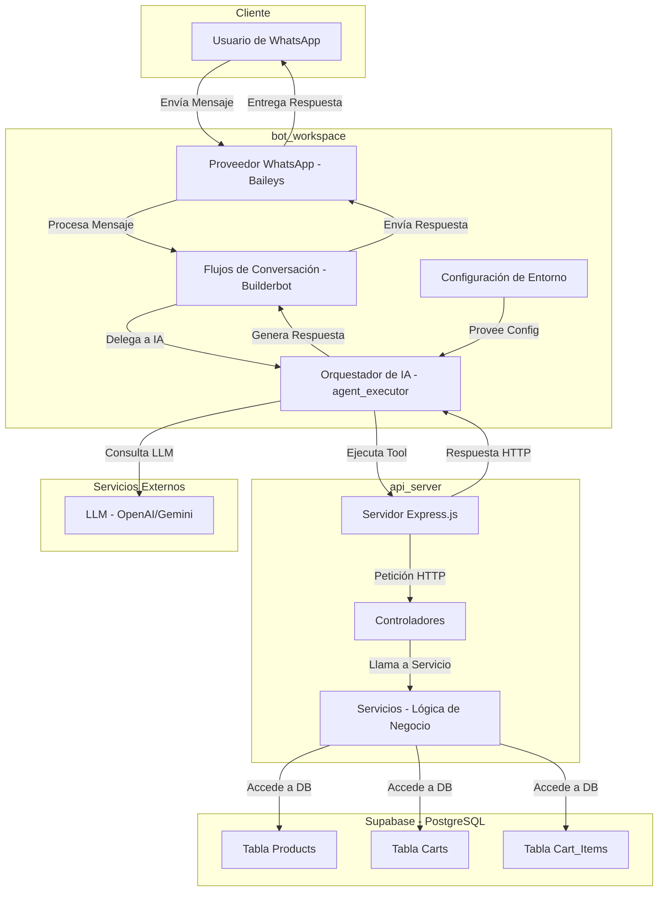

# Arquitectura de Alto Nivel del Proyecto

Este documento describe la arquitectura de alto nivel del proyecto "Agente de Ventas con IA para WhatsApp", detallando sus componentes principales y cómo interactúan entre sí.

## 1. Visión General

El proyecto se concibe como un monorepo que desacopla la lógica de negocio (API REST) de la inteligencia conversacional (Agente de IA). Esto permite una mayor escalabilidad y mantenibilidad de cada componente.

## 2. Componentes Principales

### 2.1. Cliente (Usuario de WhatsApp)

El usuario final interactúa con el sistema a través de la aplicación de WhatsApp, enviando mensajes en lenguaje natural.

### 2.2. Configuración de Entorno (`config/config.js`)

Gestiona las variables de entorno y las URLs de la API, permitiendo que el bot se adapte a diferentes entornos (desarrollo, producción).

### 2.3. Bot (`bot_workspace`)

Es el componente inteligente que gestiona la conversación con el usuario.

- **Proveedor WhatsApp (Baileys):** Se encarga de la conexión y comunicación con la API de WhatsApp.
- **Flujos de Conversación (Builderbot):** Define la estructura básica de la conversación y los puntos de entrada. El `agentFlow` es el encargado de delegar la conversación al Motor de IA.
- **Motor de IA (LLM + Tools):**
  - **LLM (Large Language Model):** Utiliza un modelo de lenguaje grande (ej. OpenAI GPT) para entender la intención del usuario, procesar el lenguaje natural y generar respuestas.
  - **Tools (Herramientas):** Son funciones predefinidas que el LLM puede "llamar" para interactuar con la API REST. Cada herramienta encapsula una funcionalidad específica (ej. `getProducts`, `createCart`, `updateCart`).
  - **`agent_executor.js`:** Orquesta la interacción entre el LLM, los prompts del sistema y la ejecución de las herramientas.

### 2.4. API (`api_server`)

Es un servidor RESTful que expone la lógica de negocio relacionada con productos y carritos.

- **Servidor Express.js:** Framework para construir la API.
- **Controladores (`src/controllers`):** Reciben las peticiones HTTP, validan los datos de entrada y delegan la lógica a los servicios.
- **Servicios (`src/services`):** Contienen la lógica de negocio principal, interactuando directamente con la base de datos.
- **`api.js`:** Punto de entrada para despliegues serverless (ej. Vercel).
- **`index.js`:** Punto de entrada para el desarrollo local del servidor API.

### 2.5. Base de Datos (Supabase - PostgreSQL)

Almacena la información de los productos, carritos y los ítems dentro de cada carrito.

- **Tablas:** `products`, `carts`, `cart_items`.
- **`database/supabase.js`:** Cliente de Supabase para interactuar con la base de datos.
- **`database/supabase.adapter.js`:** Adaptador de Supabase para Builderbot.

### 2.6. Servicios Externos

- **LLM (OpenAI):** El modelo de lenguaje grande que proporciona la inteligencia conversacional al bot.

## 3. Flujo de Interacción General

1.  El usuario envía un mensaje a WhatsApp.
2.  El **Proveedor WhatsApp** del bot recibe el mensaje.
3.  El mensaje es procesado por los **Flujos de Conversación**, que lo dirigen al **Motor de IA**.
4.  El **Motor de IA** (LLM) interpreta la intención del usuario.
5.  Si la intención requiere datos o acciones de negocio, el LLM "llama" a una de las **Herramientas** disponibles.
6.  La **Herramienta** realiza una petición HTTP a la **API REST**.
7.  La **API REST** procesa la petición a través de sus controladores y servicios, interactuando con la **Base de Datos**.
8.  La **API REST** devuelve una respuesta a la **Herramienta**.
9.  El **Motor de IA** utiliza la respuesta de la herramienta para generar una respuesta en lenguaje natural para el usuario.
10. El **Bot** envía esta respuesta al usuario a través de WhatsApp.
