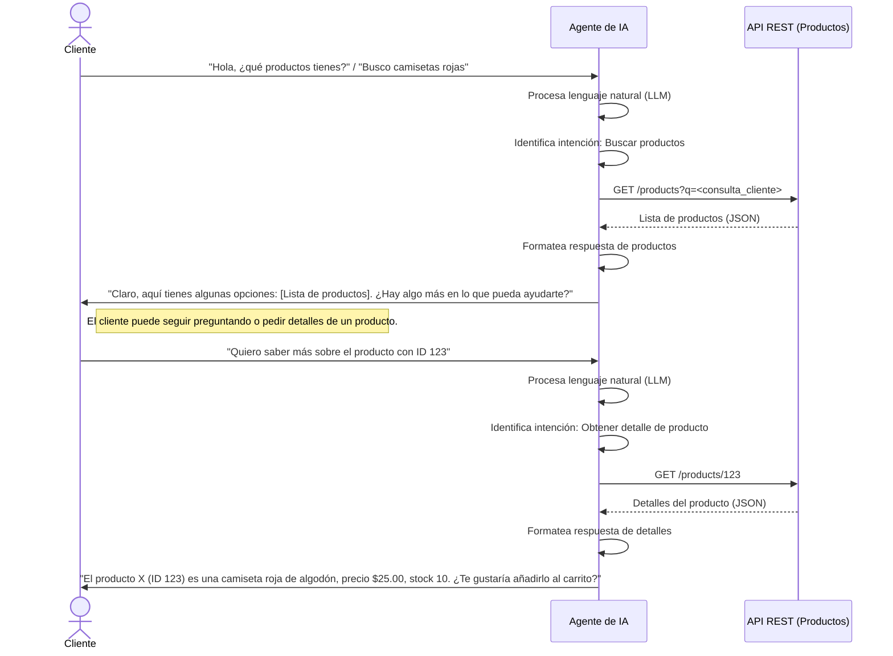
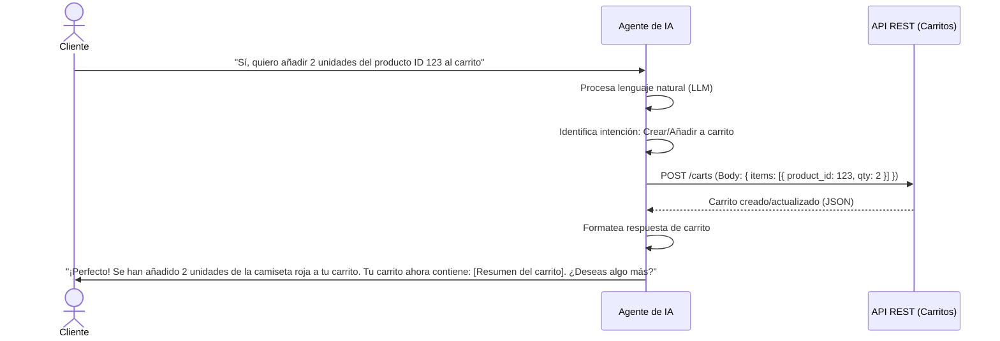
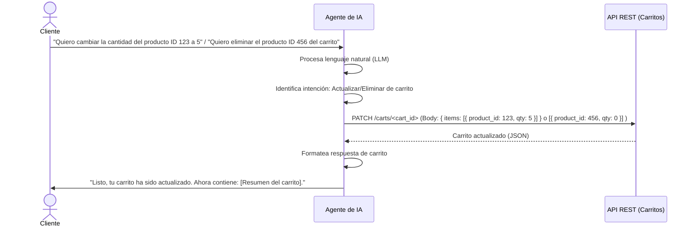

# Mapa de Flujo del Agente de IA

Este documento ilustra el flujo de interacción del agente de IA con un cliente, desde la exploración de productos hasta la gestión del carrito de compras.

## 1. Exploración de Productos

## 2. Creación de Carrito

## 3. Edición de Carrito (Extra)

